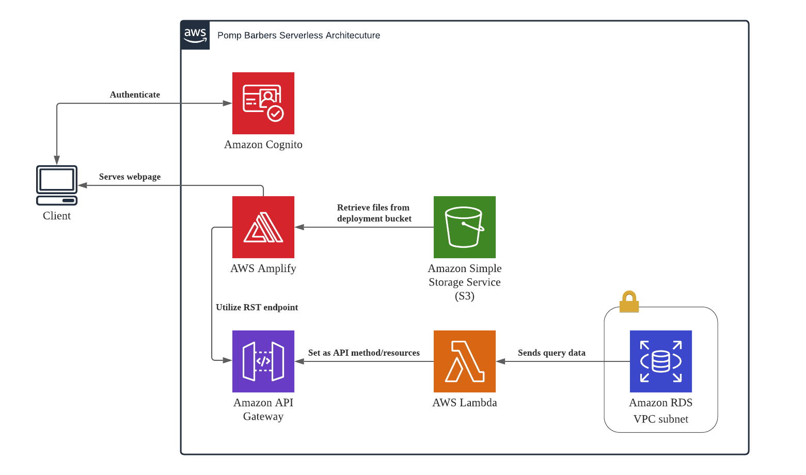

# Pomp Barbers

Pomp Barbers is a serverless barber booking system hosted on Amazon Web Services.

# Features!

  - Register as a new user with email confirmation
  - Login into the booking dashboard
  - Book timeslots and create a new barber appointment
  - Shopkeepers can grey out timeslots as unavailable

# Frontend Stack

* [Angular 10](https://angular.io/) - Frontend Framework

# Cloud Stack

Pomp Barbers uses a number of AWS services to work:



* [Amazon Amplify](https://aws.amazon.com/amplify/) - Severless hosting for web apps
* [Amazon API Gateway](https://aws.amazon.com/api-gateway/) - REST API
* [Amazon Cognito](https://aws.amazon.com/cognito/) - Manage user pools and authentication
* [AWS Lambda](https://aws.amazon.com/lambda/) - Run code serverlessly
* [Amazon RDS](https://aws.amazon.com/rds/) - Manage databases
* [Amazon S3](https://aws.amazon.com/s3/) - Data repository

### Installation

Pomp Barbers requires [Node.js](https://nodejs.org/) v4+ to run.

Install the dependencies and devDependencies and start the server.

```sh
$ npm install 
$ ng serve
```

License
----

Azman Salleh (2020)


**Note: This is a POC project**


